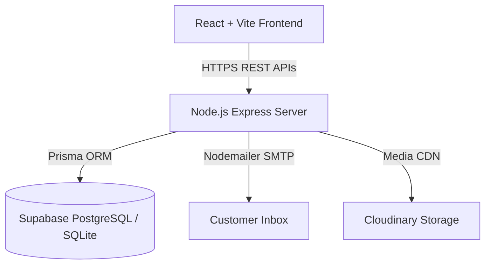

# StyleVerse Enterprise Architecture & System Specification

## 1. Executive Summary

StyleVerse is a high-concurrency, fully dynamic enterprise e-commerce platform built for clothing, sarees, kurtis, and jewellery retail. It features a zero-code Admin Panel allowing business owners to control every visible component, pricing model, flash sale, coupon, legal document, and product catalog dynamically from a database.

---

## 2. Technology Stack

- **Frontend**: React 18, Vite 5, Redux Toolkit, Tailwind CSS, Framer Motion, React Router v6, Axios.
- **Backend**: Node.js 20, Express.js 4, Prisma ORM 5.
- **Database**: SQLite (Local Dev) / Supabase PostgreSQL (Production).
- **Storage**: Cloudinary CDN.
- **Hosting & Infrastructure**: Vercel (Frontend), Render (Backend API), GitHub Actions (CI/CD).

---

## 3. Core Subsystems & Data Flow

### System Layer Responsibilities:
1. **Presentation Layer (`/client`)**: Modular React components, Redux Toolkit slices (`auth`, `cart`, `wishlist`, `settings`), Tailwind CSS tokens.
2. **API & Business Logic Layer (`/server`)**: Async route controllers, Express middlewares (JWT auth, rate limiting, error handling, activity logging).
3. **Data Layer (`/server/prisma`)**: Prisma ORM models with relational constraints (`User`, `Product`, `Category`, `Order`, `OrderItem`, `Review`, `Notification`, `ContactMessage`, `SEOSetting`).
